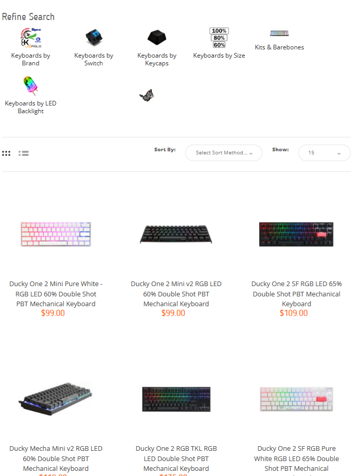
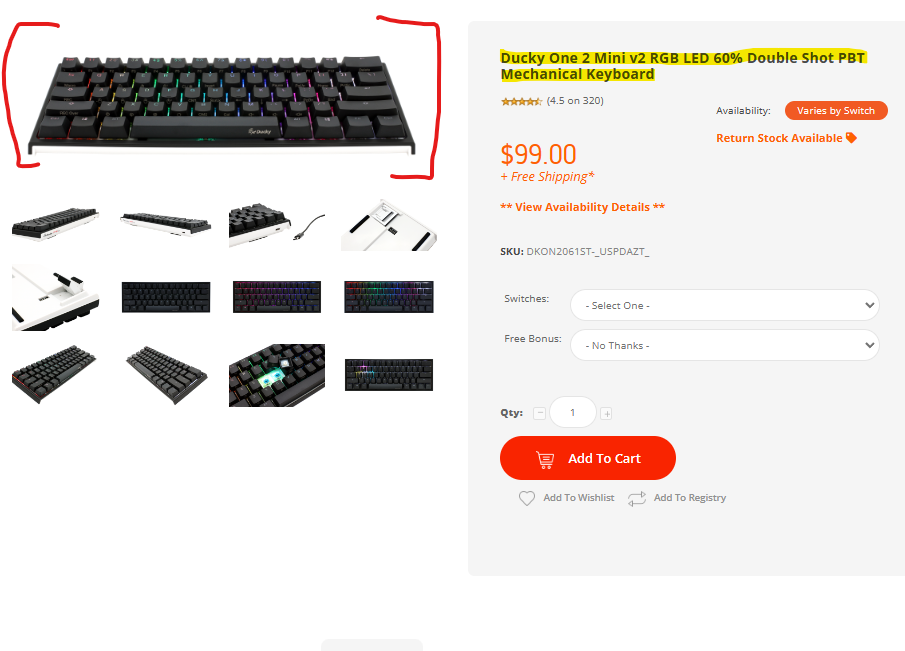
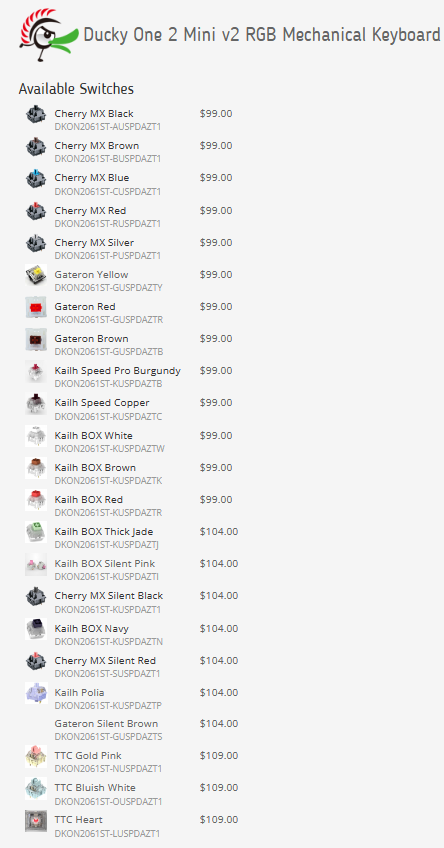
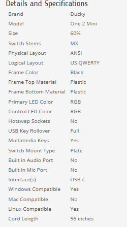

# Mechanical Keyboard Web Scraping

This project scraps the available item on the [Mechanical Keyboards](https://mechanicalkeyboards.com/shop/index.php?l=product_list&c=1) website
Tool in this project : BeautifulSoup, requests

# Flow
First it accesses to [Mechanical Keyboards](https://mechanicalkeyboards.com/shop/index.php?l=product_list&c=1) website to scrap all the available item url in the listing page and return a csv file with all product url (it should not be csv file)

Next it accesses each product page to scrap data
Target : Product name, avaialble switches and prices, product spec

All of this data will be store in the json file

# Result
Json file "products.json" stores all the available product with detail. It can be used for different project

# Limitation
Runtime is long (more than 10 minutes to finish). There should have been a faster way to scrap this
The data is not stored properly.

# Overall
This is a small project that I practice my skills. These data will be used in different project. Stay tuned !!!

